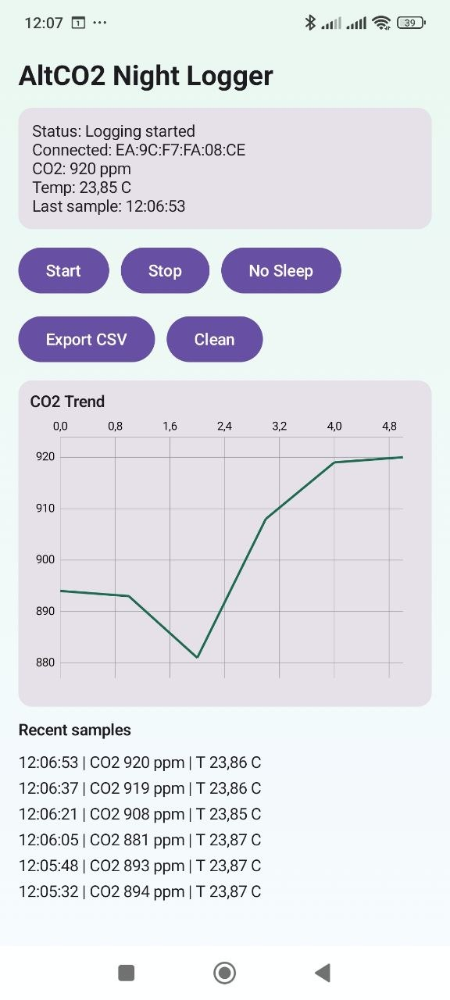

# AltCO2 Logger (Android)

Android-приложение для логирования CO2/температуры по BLE с прошивки AltCO2.

- Firmware repo: [AltCO2](https://github.com/Batov/AltCO2)

## Возможности

- Поиск BLE-устройства `AltCO2`
- Подключение к Environmental Sensing Service (`0x181A`)
- Подписка на характеристики:
  - CO2: `0x2B8C`
  - Temperature: `0x2A6E`
- Фоновый логгер (foreground service)
- Сохранение измерений в Room
- Экран со статусом, live-значениями и графиком CO2
- Экспорт измерений в CSV
- Очистка всех сохраненных измерений через кнопку `Clean` с подтверждением

## Скриншот

## Сборка

1. Открыть папку проекта в Android Studio.
2. Дождаться Gradle Sync.
3. Собрать debug APK:
   - `Build > Build APK(s)`
4. Установить `app-debug.apk` на Android.

## Для ночной записи

- Выдать разрешения Bluetooth/Location/Notifications.
- Нажать `No Sleep` и разрешить исключение из энергосбережения.
- Нажать `Start` перед сном.
